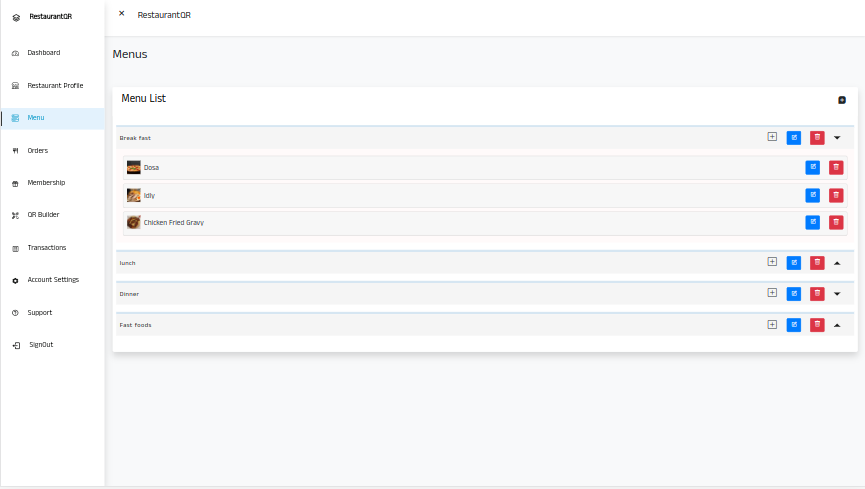

# RestaurantQR Django Apllication.
This project is a SAAS application created using Django Framework, intented to created for Restaurants.  
The Business Usage of this app is
The Restaurant Owners can Create and edit food menus, The app will automatically create QR code for specific Restaurant.
and the Customers can just scan the QR code on there mobile phone to get the all menus. and they can select menus and make order through mobile.

### The App has two panels.
**Admin Panel**
- That panel only accesable for product owner or the product provider to manage User accounts. 

**User Panel(Restaurant Owners)**
- that was accesable for Restaurant owners to manage food menus.

**Customer Page**
- The each restaurant user account has a own link to show up there all menus. that are shows on customer's mobile.

## Features
- Multi Language support
- Internatioal Currncy Support
- Esay to get and review user queries
- Customizable options
- Payment Gateway Integration

## Screen shots
### Admin Panel

### User Panel

### Restaurant Customer Page

